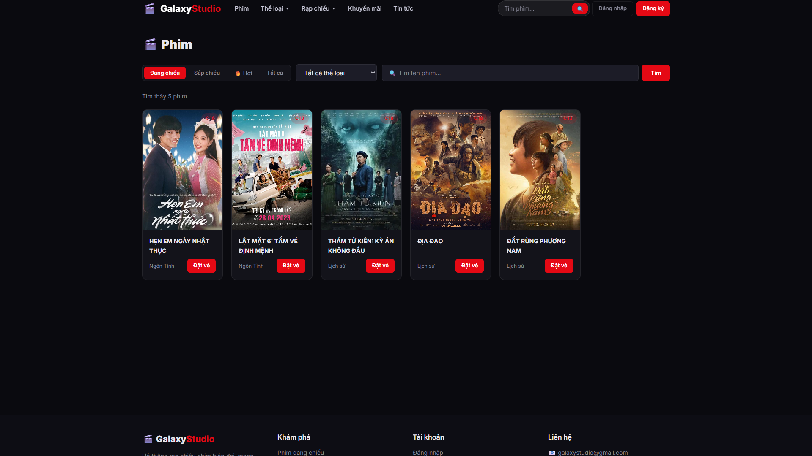

# 🎬 Galaxy Studio — Hệ thống đặt vé xem phim

> Dự án fullstack React + NodeJS, migrate từ PHP/MySQL legacy.

## 📁 Cấu trúc dự án

```
webphim/
├── client/                 # React (Vite)
│   └── src/
│       ├── components/     # Layout components (Header, Footer, AdminSidebar)
│       ├── context/        # AuthContext, BookingContext
│       ├── pages/
│       │   ├── user/       # 12 trang người dùng
│       │   └── admin/      # 11 trang quản trị
│       ├── services/       # api.js (Axios + auto-refresh)
│       └── main.jsx
├── server/                 # NodeJS (Express)
│   └── src/
│       ├── config/         # db.js (MySQL2 pool)
│       ├── controllers/    # 14 controllers
│       ├── middleware/     # JWT auth, RBAC, Multer upload
│       ├── routes/         # 10 route files
│       └── scripts/        # migrate-passwords.js
└── package.json            # Root dev scripts
```

## 🚀 Khởi động

### Cài đặt dependencies
```bash
cd server && npm install
cd client && npm install
```

### Cấu hình môi trường
Tạo file `server/.env`:
```
DB_HOST=localhost
DB_PORT=3306
DB_USER=root
DB_PASSWORD=
DB_NAME=webphim

JWT_SECRET=galaxy_studio_secret_2024
JWT_REFRESH_SECRET=galaxy_studio_refresh_2024

SMTP_HOST=smtp.gmail.com
SMTP_PORT=587
SMTP_USER=your@gmail.com
SMTP_PASS=your_app_password
SMTP_FROM=Galaxy Studio <your@gmail.com>

FRONTEND_URL=http://localhost:5173
PORT=3001
```

### Chạy development
```bash
# Terminal 1: Backend
cd server && npm run dev

# Terminal 2: Frontend
cd client && npm run dev
```

### Migration mật khẩu (chạy 1 lần)
```bash
cd server && node src/scripts/migrate-passwords.js
```

## 📸 Giao diện ứng dụng (Screenshots)

Dưới đây là một số hình ảnh giao diện của hệ thống:

### Trang Khách Hàng (User)
> 💡 **Ghi chú**: Hãy chụp màn hình trang chủ và trang đặt vé của khách hàng rồi lưu vào thư mục `assets/` với tên `home.png` và `booking.png`.

| Trang Chủ | Đặt Vé |
| --------- | -------- |
|  |  |

### Trang Quản Trị (Admin)
> 💡 **Ghi chú**: Hãy chụp màn hình trang quản lý (Dashboard) và chức năng khác rồi lưu vào thư mục `assets/` với tên `admin_dashboard.png` và `admin_movies.png`.

| Dashboard | Quản Lý Phim |
| --------- | -------- |
| ![Dashboard]
| ![Quản Lý Phim]
| ![Quản Lý Rạp]
| ![Quản Lý Vé]


## 🌐 URLs

| Service  | URL                         |
|----------|-----------------------------|
| Frontend | http://localhost:5173        |
| Backend  | http://localhost:3001        |
| API Docs | http://localhost:3001/api/health |

## 🔐 Vai trò hệ thống

| Vai trò | Mô tả | Quyền hạn |
|---------|-------|-----------|
| 0 | Khách hàng | Đặt vé, tích điểm |
| 1 | Nhân viên | Quét vé, xem lịch |
| 2 | Admin | Toàn quyền hệ thống |
| 3 | Quản lý Rạp | Quản lý rạp cụ thể |
| 4 | Quản lý Cụm | Quản lý nhiều rạp |

## 📋 API Endpoints

| Method | Endpoint | Mô tả |
|--------|----------|-------|
| POST | /api/auth/login | Đăng nhập |
| POST | /api/auth/register | Đăng ký |
| GET | /api/phim | Danh sách phim |
| GET | /api/rap | Danh sách rạp |
| GET | /api/lich-chieu | Lịch chiếu |
| POST | /api/ve/dat-ve | Đặt vé |
| POST | /api/scan-ve | Quét vé |
| GET | /api/thong-ke/summary | Tổng quan thống kê |
